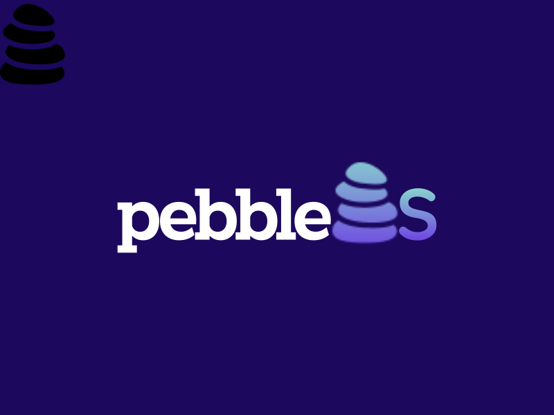

<h3 align="center">
  
</h3>

<h4 align="center">
  🪨 Rock solid stability, 🪶 lightweight, 🪟 Windows
</h4>

# ℹ️ About

 **pebbleOS** is an Open Source [Ameliorated Playbook](https://ameliorated.io/) that modifies your Windows installation to remove ✂ _bloatware_, improve your 🔐 _privacy_, increase 🧱 _security_., and improve ✈ _performance_. This is acheived through _component removal_, _group policy_ settings, _registry_ settings, and more.

pebbleOS is based off of (mostly copied from 😅) the following excellent projects:

- [Atlas](https://github.com/Atlas-OS/Atlas/releases/latest)
- [Revision](https://github.com/meetrevision/playbook/releases/latest)
- [Ameliorated AME11](https://ameliorated.io/#:~:text=AME%2011)

The changes are a combination of the tweaks used in their respective Playbooks, as well as a few personal tweaks. Please check out their projects! They may suit your needs better. You can also visit each project's codebase by visting the [`sources`](./sources/) folder in this repo.

What makes  pebbleOS different is it doesn't do any system component removal. This will allow you to still use Windows Update without any problems, and will minimize any system breakage/weirdness you'll come across.

In my experience, there were often _strange_ issues that would come up related to Windows component removal, which caused some sort of dealbreaker. I'd then need to return to the drawing board and likely have to re-install Windows, as there was no other option to fix it on the live install.

# 🎨 Features

### 🪟 **Bring your own Windows**

Because  pebbleOS is a Playbook, you are free to run it on whatever Windows 10 / 11 / LTSC / [NTLite](https://www.ntlite.com/) ISO you have installed.

I'd recommend at least a **Pro** or higher SKU, as I'm unsure if Group Policy templates can apply on Home SKUs.

### ✂ **Remove Bloatware**

A whole host of unused (maybe, for your use case) APPX bloat has been removed (you can always reinstall stuff, like _Weather_ or _Paint_, from the Microsoft Store if you like those!). Edge and OneDrive are removed. Certain commonly unused Windows Features are disabled.

### 🔐 **Better Privacy**

From many, many registry edits and group policy settings (!) which disable passive data collection from Microsoft.

### 🧱 **Better Security**

Certain Windows registry settings and features have been hardened. I don't want to pretend it's by any means comprehensive though - you can go [far above and beyond](https://github.com/simeononsecurity/Standalone-Windows-STIG-Script) what is done here!

### ✈ **Better Performance**

Custom powerplan (from ReviOS), less background tasks, less drive thrashing

### 🔗 **More Compatible**

Unlike some ISOs or modification scripts which could break certain Windows functionality irrevocably, modifications done in pebbleOS are mostly reversible. (_some APPX apps, like Cortana, could potentially not be straightfoward to get back_)

That is to say,

- Windows Update should work as expected.
- Settings pages should work as expected.
  - (_Group Policy or Registry settings which gray out certain items would need to be removed though, to get those back_)
- Generally, there should hopefully be much less extremely niche, peculiar issues you'll come across which send you on a 3 hour Google triage only to find out (or rather, make you guess) that it's related to some component you removed from the OS that is literally impossible or unfeasable to get back.
- Should reduce or eliminate the need to do any entire OS re-installs, should pebbleOS update

# ⚠ Notes

- As of writing, I have only tested this on Windows 10 22H2 and Windows 10 LTSC 2021. It will likely run just fine on Windows 11, but I'd like to look around and see if there are more relevant registry / GPO settings to apply specifically on Windows 11 (such as hiding the "Recommended" section on the Start Menu, etc.)

- Playbook on LTSC seems to error where 10 22H2 does not. The entire playbook has run regardless, but the errors _appear_ to be related to registry locations that just aren't present on LTSC - so those items error. Shouldn't be an issue.

- Playbook, at least on my machine (but not test VMs?), errors before the process can even begin, as Amelieroated fails to disable Windows Defender. I can fix this by running the commands it is complaining about in the Error Log manually through a [RunAsTi](https://github.com/jschicht/RunAsTI) Command Prompt. Not sure why this happens.

- Most breakage will likely stem from a disabled service. Check [`src\Configuration\tasks\default\services.yml`](src\Configuration\tasks\default\services.yml) for a list of modified services!

- TODO: Windows Defender, performance from Spectre/Meltdown tradeoff note, howto

# 🛠️ Installation

Installation is unlike previous methods which often involved creating a bootable USB with an ISO file. Instead, we run Ameliorated's tool on an active Windows installation.

Download the required files:

- [AME Wizard from Amerliorated's website](https://ameliorated.io/)

- [The current pebbleOS release](https://github.com/pebble-os/pebble-os/releases/latest)

Import the  pebbleOS Playbook in the AME Wizard and run it! Once the Playbook finishes running, Windows will restart (or you should restart Windows) and the process is complete!
